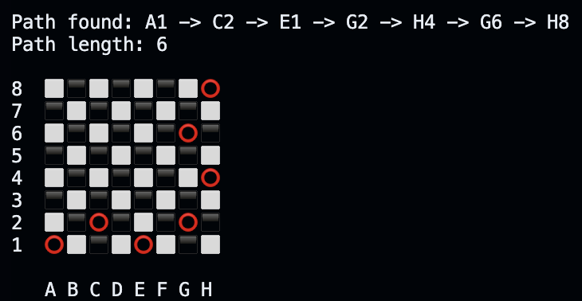

<strong>Knights Travails Project</strong>

Finds and shows, the shortest path for a knight, moving in the classic 'L' shape a knight moves in, to get from one square to another. 

<strong>Example:</strong> from A1 -> H8



<strong>Clone the repostitory:</strong>
```
git clone git@github.com:hub-mm/travelling_knight.git
```
<strong>Navigate to repo:</strong>
```
cd travelling_knight
```

<strong>Edit main.rb content with which ever test you want:</strong> (caps or lowercase)
```
test.knight_moves(['F', 4], ['C', 8])
test.knight_moves(['h', 3], ['d', 2])
```

<strong>Start test:</strong>
```
ruby main.rb
```
It will output the shortest path and amount of moves taken.

Hope you enjoy.  
I had a lot of fun building this project!  

Thank you for checking it out!

